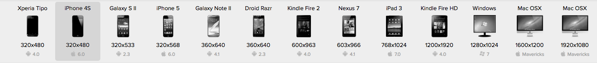
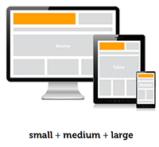
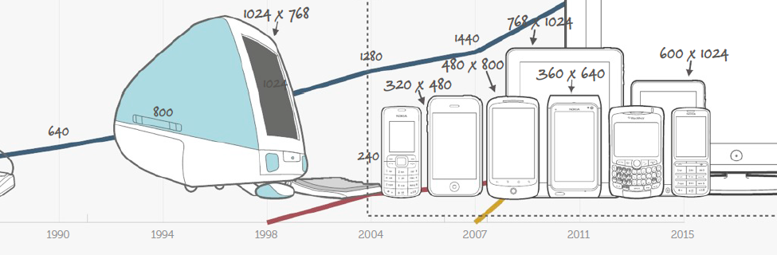
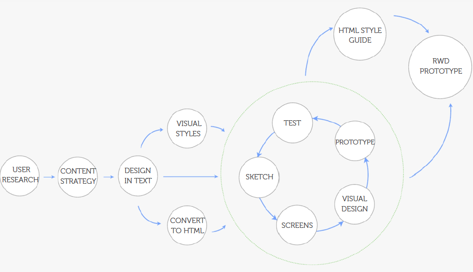
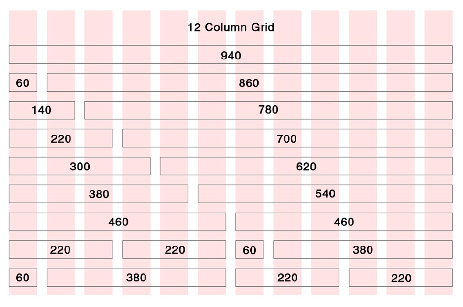
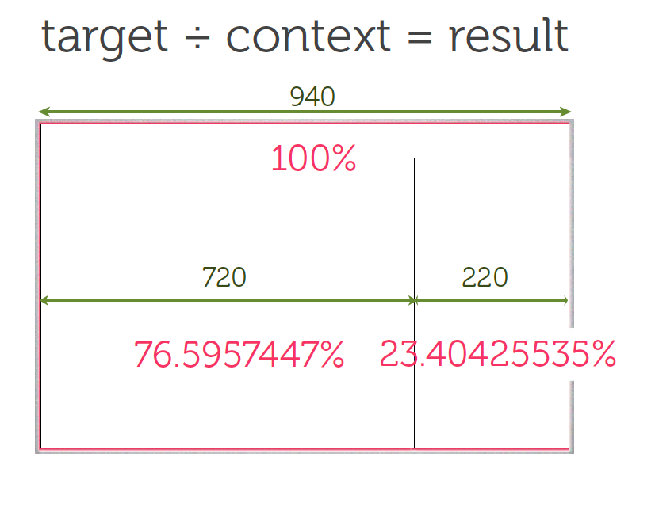

#Responsive web design

<http://alistapart.com/article/responsive-web-design>

samples:
<http://mediaqueri.es>

Responsive Web Design (RWD) is an approach to web design in which a site is created to provide an optimal viewing experience-easy reading and navigation adapt to a wide range of devices (from desktop computer monitors to mobile phones)

Responsive websites respond to their environment



how to display:




## Why

* 1/3 of people has a smartphone
* 76% use mobile while waiting in queues or for appointments




## Responsive design process



## How:

### Allow browsers scale

```html
<meta name="viewport" content="width=device-width, initial-scale=1" />
```
### Don't use fixed width, use % or auto

### User elative font-size em, don't use px
### fluid grid
### Media query
```html
<link rel="stylesheet" type="text/css"　media="screen and (min-width: 400px) and (max-device-width: 600px)"　　href="smallScreen.css" />
　　　　
```

```css

  @media screen and (max-device-width: 400px) {
　　　　.column {
　　　　　　float: none;
　　　　　　width:auto;
　　　　}
　　　　#sidebar {
　　　　　　display:none;
　　　　}
　　 }

```


### 12 columns grid layout



### Calc



## Responsive Content
### Text
* Modern browsers have a 16px font default
* body {font-size:62.5%;} -->16*0.625=10px
* p {font-size:1.3em}
* top and line-height should be em's
* avoid nested em definitions
### Image
<http://alistapart.com/article/fluid-images>

<http://srobbin.com/jquery-plugins/backstretch/>
### Media
### Navigation
Dropdown-menu for mobile, reference bootstrap
